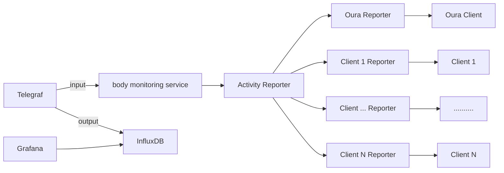

We do monitor different systems. Why not to monitor a human body as a system?

This project is to gather some metrics and represent them with Grafana. 

In the beginning there will be only Oura Ring as a source of the data.

