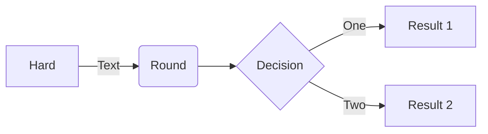
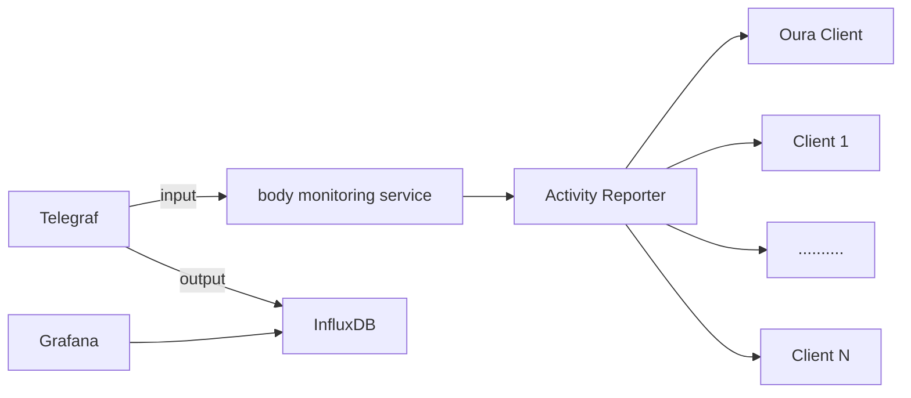

# mermaid [](https://travis-ci.org/mermaid-js/mermaid) [](https://www.npmjs.com/package/mermaid) [](https://coveralls.io/github/mermaid-js/mermaid?branch=master) [](https://join.slack.com/t/mermaid-talk/shared_invite/enQtNzc4NDIyNzk4OTAyLWVhYjQxOTI2OTg4YmE1ZmJkY2Y4MTU3ODliYmIwOTY3NDJlYjA0YjIyZTdkMDMyZTUwOGI0NjEzYmEwODcwOTE) [](https://percy.io/Mermaid/mermaid)

English | [简体中文](./README.zh-CN.md)


:trophy: **Mermaid was nominated and won the [JS Open Source Awards (2019)](https://osawards.com/javascript/2019) in the category "The most exciting use of technology"!!!**

**Thanks to all involved, people committing pull requests, people answering questions! 🙏**

<a href="https://mermaid-js.github.io/mermaid/landing/" alt="Link to landing page for the book The Official Guide To mermaid.js"></a>

## About

<!-- <Main description>   -->
Mermaid is a Javascript based diagramming and charting tool that uses Markdown-inspired text definitions and a renderer to create and modify complex diagrams.  The main purpose of Mermaid is to help documentation catch up with development.

> Doc-Rot is a Catch-22 that Mermaid helps to solve.

Diagramming and documentation costs precious developer time and gets outdated quickly.
But not having diagrams or docs ruins productivity and hurts organizational learning. <br/>
Mermaid addresses this problem by cutting the time, effort and tooling that is required to create modifiable diagrams and charts, for smarter and more reusable content.
The text definitions for Mermaid diagrams allows for it to be updated easily, it can also be made part of production scripts (and other pieces of code).
So less time needs to be spent on documenting, as a separate and laborious task. <br/>
Even non-programmers can create diagrams through the [Mermaid Live Editor](https://mermaid-js.github.io/mermaid-live-editor/).<br/>
[Tutorials](./docs/Tutorials.md) has video tutorials.
Use Mermaid with your favorite applications, check out the list of [Integrations and Usages of Mermaid](./docs/integrations.md).

For a more detailed introduction to Mermaid and some of its more basic uses, look to the [Beginner's Guide](./docs/n00b-overview.md) and [Usage](./docs/usage.md).

🌐 [CDN](https://unpkg.com/mermaid/) | 📖 [Documentation](https://mermaidjs.github.io) | 🙌 [Contribution](https://github.com/mermaid-js/mermaid/blob/develop/CONTRIBUTING.md) | 📜 [Changelog](./docs/CHANGELOG.md)

<!-- </Main description> -->

## Examples

__The following are some examples of the diagrams, charts and graphs that can be made using Mermaid and the Markdown-inspired text specific to it. Click here jump into the [text syntax](https://mermaid-js.github.io/mermaid/#/n00b-syntaxReference).__
<!-- <Flowchart> -->

## Flowchart [<a href="http://mermaid-js.github.io/mermaid/#/flowchart">docs</a> - <a href="https://mermaidjs.github.io/mermaid-live-editor/#/edit/eyJjb2RlIjoiZ3JhcGggVERcbiAgICBBW0hhcmRdIC0tPnxUZXh0fCBCKFJvdW5kKVxuICAgIEIgLS0-IEN7RGVjaXNpb259XG4gICAgQyAtLT58T25lfCBEW1Jlc3VsdCAxXVxuICAgIEMgLS0-fFR3b3wgRVtSZXN1bHQgMl0iLCJtZXJtYWlkIjp7InRoZW1lIjoiZGVmYXVsdCJ9fQ">live editor</a>]

```
flowchart LR
A[Hard] -->|Text| B(Round)
B --> C{Decision}
C -->|One| D[Result 1]
C -->|Two| E[Result 2]
```



## Sequence diagram [<a href="http://mermaid-js.github.io/mermaid/#/sequenceDiagram">docs</a> - <a href="https://mermaidjs.github.io/mermaid-live-editor/#/edit/eyJjb2RlIjoic2VxdWVuY2VEaWFncmFtXG5BbGljZS0-PkpvaG46IEhlbGxvIEpvaG4sIGhvdyBhcmUgeW91P1xubG9vcCBIZWFsdGhjaGVja1xuICAgIEpvaG4tPj5Kb2huOiBGaWdodCBhZ2FpbnN0IGh5cG9jaG9uZHJpYVxuZW5kXG5Ob3RlIHJpZ2h0IG9mIEpvaG46IFJhdGlvbmFsIHRob3VnaHRzIVxuSm9obi0tPj5BbGljZTogR3JlYXQhXG5Kb2huLT4-Qm9iOiBIb3cgYWJvdXQgeW91P1xuQm9iLS0-PkpvaG46IEpvbGx5IGdvb2QhIiwibWVybWFpZCI6eyJ0aGVtZSI6ImRlZmF1bHQifX0">live editor</a>]


We do monitor different systems. Why not to monitor a human body as a system?

This project is to gather some metrics and represent them with Grafana. 

In the beginning there will be only Oura Ring as a source of the data.


